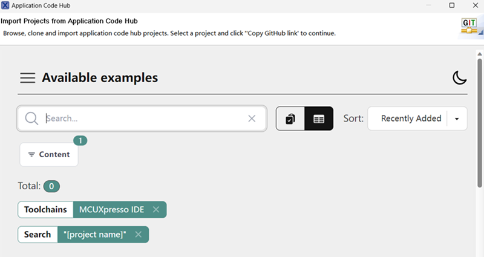
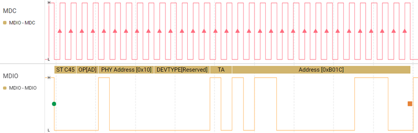

# NXP Application Code Hub

[](https://www.nxp.com)

## How to use SmartMDA to implement MDIO slave interface on MCX MCU

This software accompanies the application note primarily introduces how to implement MDIOI slave interface functionality using SmartDMA.<br />

#### Boards: FRDM-MCXN947

#### Categories: HMI, Industrial, Networking, User Interface

#### Peripherals: ETHERNET, GPIO

#### Toolchains: IAR

## Table of Contents

1. [Software](#step1)
2. [Hardware](#step2)
3. [Setup](#step3)
4. [Results](#step4)
5. [Support](#step5)
6. [Release Notes](#step6)

## 1. Software<a name="step1"></a>

- [MCUXpresso IDE V11.10.0 or later](https://www.nxp.com/design/design-center/software/development-software/mcuxpresso-software-and-tools-/mcuxpresso-integrated-development-environment-ide:MCUXpresso-IDE).
- SDK_2_16_000_FRDM-MCXN947
- MCUXpresso for Visual Studio Code: This example supports MCUXpresso for Visual Studio Code, for more information about how to use Visual Studio Code please refer [here](https://www.nxp.com/design/training/getting-started-with-mcuxpresso-for-visual-studio-code:TIP-GETTING-STARTED-WITH-MCUXPRESSO-FOR-VS-CODE).

## 2. Hardware<a name="step2"></a>

- Type-C USB cable
- two sets of FRDM-MCXN947
- Personal Computer
- Logic device: Saleae logic pro16
- Some Dupont wires

## 3. Setup<a name="step3"></a>

### 3.1 Step 1

This application requires two FRDM-MCXN947 boards to implement MDIO communication, with one acting as the MDIO master and the other as the MDIO slave. The two boards are connected through two pins and ground. The hardware connections are shown in the table below. 

| **Function** | **MDIO Master FRDM-MCXN947**  **Board** | **MDIO Slave  FRDM-MCXN947**  **Board** |
| ------------ | --------------------------------------- | --------------------------------------- |
| MDIO         | J1-7(P1-21)                             | J1-1(P3_16)                             |
| MDC          | Pad 1 of R191(remove R191) (P1_20)      | J1-5(P3_20)                             |
| GND          | J5-8(GND)                               | J5-8(GND)                               |

1. Connect logic device to PC with USB cable, connect the logical device to the MDIO signal.

2. Connect FRDM-MCXN947 boards to PC with USB type-C cable.

3. Connect the signal pins of the two FRDM-MCXN947 boards.

   

### 3.1 Step 2

- Prepare the master board firmware

It is worth mentioning that the MCXN947's Ethernet peripheral has MDIO master functionality. Users can demonstrate the MDIO master function through the example named “txrx_rxpoll” in the corresponding SDK. The example path is SDK_2_16_000_FRDM-MCXN947\boards\frdmmcxn947\driver_examples\enet\txrx_rxpoll.

The important code routines are as follows:

````
```
**static** **void** **MDIO_Init**(**void**)

{

  (**void**)CLOCK_EnableClock(s_enetClock[ENET_GetInstance(EXAMPLE_ENET_BASE)]);

  EXAMPLE_ENET_BASE->MAC_MDIO_ADDRESS = ENET_MAC_MDIO_ADDRESS_CR(0);

}

 

**static** status_t **MDIO_Write**(uint8_t phyAddr, uint8_t devAddr,uint16_t regAddra, uint16_t data)

{

  uint32_t reg = EXAMPLE_ENET_BASE->MAC_MDIO_ADDRESS & ENET_MAC_MDIO_ADDRESS_CR_MASK;

 

  /* Build MII write command. */

  EXAMPLE_ENET_BASE->MAC_MDIO_ADDRESS =

​    reg | ENET_MAC_MDIO_ADDRESS_GOC_0(1) | ENET_MAC_MDIO_ADDRESS_PA(phyAddr) | ENET_MAC_MDIO_ADDRESS_RDA(devAddr)| ENET_MAC_MDIO_ADDRESS_C45E(1);

  EXAMPLE_ENET_BASE->MAC_MDIO_DATA = (regAddra << 16) | data;

  EXAMPLE_ENET_BASE->MAC_MDIO_ADDRESS |= ENET_MAC_MDIO_ADDRESS_GB_MASK;

  **while** (((EXAMPLE_ENET_BASE->MAC_MDIO_ADDRESS & ENET_MAC_MDIO_ADDRESS_GB_MASK) != 0U))

  {

  }

}

 **static** status_t **MDIO_Read**(uint8_t phyAddr, uint8_t devAddr, uint16_t regAddr, uint16_t *pData)

{

  uint32_t reg = EXAMPLE_ENET_BASE->MAC_MDIO_ADDRESS & ENET_MAC_MDIO_ADDRESS_CR_MASK;

 

  /* Build MII read command. */

  EXAMPLE_ENET_BASE->MAC_MDIO_ADDRESS = reg | ENET_MAC_MDIO_ADDRESS_GOC_0(1) | ENET_MAC_MDIO_ADDRESS_GOC_1(1) |ENET_MAC_MDIO_ADDRESS_PA(phyAddr) | ENET_MAC_MDIO_ADDRESS_RDA(devAddr)| ENET_MAC_MDIO_ADDRESS_C45E(1);

  EXAMPLE_ENET_BASE->MAC_MDIO_DATA = (regAddr << 16);

 

  EXAMPLE_ENET_BASE->MAC_MDIO_ADDRESS |= ENET_MAC_MDIO_ADDRESS_GB_MASK;

  **while** (((EXAMPLE_ENET_BASE->MAC_MDIO_ADDRESS & ENET_MAC_MDIO_ADDRESS_GB_MASK) != 0U))

  {

  }
  *pData = (EXAMPLE_ENET_BASE->MAC_MDIO_DATA & ENET_MAC_MDIO_DATA_GD_MASK);
}

The operations code as below:

MDIO_Init();

  **for**(uint32_t i = 0; i < 8*4; i = i+4)

  {

​      MDIO_Write(0x10, 0x20, 0x8000+i, i);

​      SDK_DelayAtLeastUs(10, SystemCoreClock);

  }

  **for**(uint32_t i = 0; i < 8*4; i = i+4)

  {

​      MDIO_Write(0x10, 0x20, 0x9000+i, i+0x100);

​      SDK_DelayAtLeastUs(10, SystemCoreClock);

  }

  **for**(uint32_t i = 0; i < 8*4; i = i+4)

  {

​      MDIO_Write(0x10, 0x20, 0xa000+i, i+0x200);

​      SDK_DelayAtLeastUs(10, SystemCoreClock);

  }

  **for**(uint32_t i = 0; i < 8*4; i = i+4)

  {

​      MDIO_Write(0x10, 0x20, 0xb000+i, i+0x300);

​      SDK_DelayAtLeastUs(10, SystemCoreClock);

  }

  **for**(uint32_t i = 0; i < 8*4; i = i+4)

  {

​    MDIO_Read(0x10, 0x20, 0x8000+i, &g_rec_data);

​    PRINTF("addr:0x%4x,RxD:0x%4x.\r\n",0x8000+i,g_rec_data);

  }

  **for**(uint32_t i = 0; i < 8*4; i = i+4)

  {

​    MDIO_Read(0x10, 0x20, 0x9000+i, &g_rec_data);

​    PRINTF("addr:0x%4x,RxD:0x%4x.\r\n",0x9000+i,g_rec_data);

  }

  **for**(uint32_t i = 0; i < 8*4; i = i+4)

  {

​    MDIO_Read(0x10, 0x20, 0xa000+i, &g_rec_data);

​    PRINTF("addr:0x%4x,RxD:0x%4x.\r\n",0xa000+i,g_rec_data);

  }

  **for**(uint32_t i = 0; i < 8*4; i = i+4)

  {

​    MDIO_Read(0x10, 0x20, 0xb000+i, &g_rec_data);

​    PRINTF("addr:0x%4x,RxD:0x%4x.\r\n",0xb000+i,g_rec_data);

  }
````

### 3.2 Step 3

- Import the slave project to MCUXpresso IDE.

1. Open MCUXpresso IDE, in the Quick Start Panel, choose **Import from Application Code Hub**.

   ​	

2. Enter the demo name in the search bar.

    

3. Click **Copy GitHub link**, MCUXpresso IDE will automatically retrieve project attributes, then click **Next>**.

   ​	

4. Select **main** branch and then click **Next>**, Select the MCUXpresso project, click **Finish** button to complete import.

   ​	

   


- Connect the micro USB cable between the PC host and the USB port (J17) on the board.
- Compile and download the master and slave firmware to the master and slave board respectively.
- Reset and run.

## 4. Results<a name="step4"></a>

1. Open the PC host software connected to the MDIO master board's serial port, then reset the boards.
2. Reset the demo boards, first resetting the MDIO slave board, then the MDIO master board.
3. You can see the serial log printed by the MDIO master board as follows:

addr:0x8000,RxD:0x  0.

addr:0x8004,RxD:0x  4.

addr:0x8008,RxD:0x  8.

addr:0x800c,RxD:0x  c.

addr:0x8010,RxD:0x  c.

addr:0x8014,RxD:0x  c.

addr:0x8018,RxD:0x  c.

addr:0x801c,RxD:0x 1c.

addr:0x9000,RxD:0x 1c.

addr:0x9004,RxD:0x 1c.

addr:0x9008,RxD:0x 108.

addr:0x900c,RxD:0x 10c.

addr:0x9010,RxD:0x 110.

addr:0x9014,RxD:0x 114.

addr:0x9018,RxD:0x 118.

addr:0x901c,RxD:0x 11c.

addr:0xa000,RxD:0x 200.

addr:0xa004,RxD:0x 204.

addr:0xa008,RxD:0x 208.

addr:0xa00c,RxD:0x 20c.

addr:0xa010,RxD:0x 210.

addr:0xa014,RxD:0x 214.

addr:0xa018,RxD:0x 218.

addr:0xa01c,RxD:0x 21c.

addr:0xb000,RxD:0x 300.

addr:0xb004,RxD:0x 304.

addr:0xb008,RxD:0x 308.

addr:0xb00c,RxD:0x 30c.

addr:0xb010,RxD:0x 310.

addr:0xb014,RxD:0x 314.

addr:0xb018,RxD:0x 318.

addr:0xb01c,RxD:0x 31c.

4. The MDIO waveform can be observed on the logic device host software tool as follows:

   

   

## 5. Support<a name="step5"></a>

*Provide URLs for help here.*

#### Project Metadata

<!----- Boards ----->

[]()

<!----- Categories ----->

[](https://github.com/search?q=org%3Anxp-appcodehub+hmi+in%3Areadme&type=Repositories)
[](https://github.com/search?q=org%3Anxp-appcodehub+industrial+in%3Areadme&type=Repositories)
[](https://github.com/search?q=org%3Anxp-appcodehub+networking+in%3Areadme&type=Repositories)
[](https://github.com/search?q=org%3Anxp-appcodehub+ui+in%3Areadme&type=Repositories)

<!----- Peripherals ----->

[](https://github.com/search?q=org%3Anxp-appcodehub+ethernet+in%3Areadme&type=Repositories)
[](https://github.com/search?q=org%3Anxp-appcodehub+gpio+in%3Areadme&type=Repositories)

<!----- Toolchains ----->

[](https://github.com/search?q=org%3Anxp-appcodehub+iar+in%3Areadme&type=Repositories)

Questions regarding the content/correctness of this example can be entered as Issues within this GitHub repository.

> **Warning**: For more general technical questions regarding NXP Microcontrollers and the difference in expected functionality, enter your questions on the [NXP Community Forum](https://community.nxp.com/)

[](https://www.youtube.com/NXP_Semiconductors)
[](https://www.linkedin.com/company/nxp-semiconductors)
[](https://www.facebook.com/nxpsemi/)
[](https://x.com/NXP)

## 6. Release Notes<a name="step6"></a>

| Version | Description / Update                    | Date                           |
|:-------:| --------------------------------------- | ------------------------------:|
| 1.0     | Initial release on Application Code Hub | September 10<sup>th</sup> 2024 |

## Licensing

*If applicable - note software licensing here with links to licenses, otherwise remove this section*

## Origin

*if applicable - note components your application uses regarding to license terms - with authors / licenses / links to licenses, otherwise remove this section*